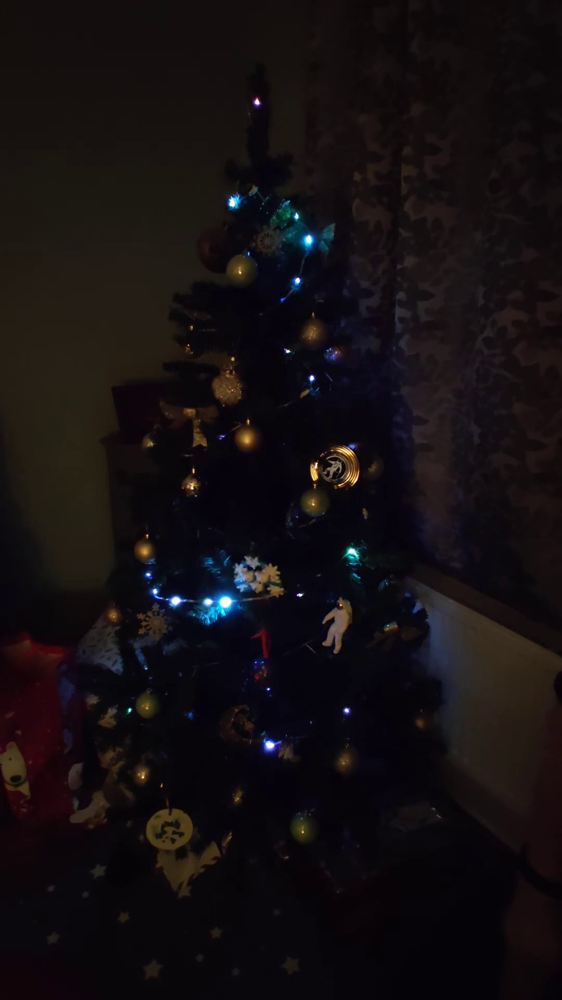
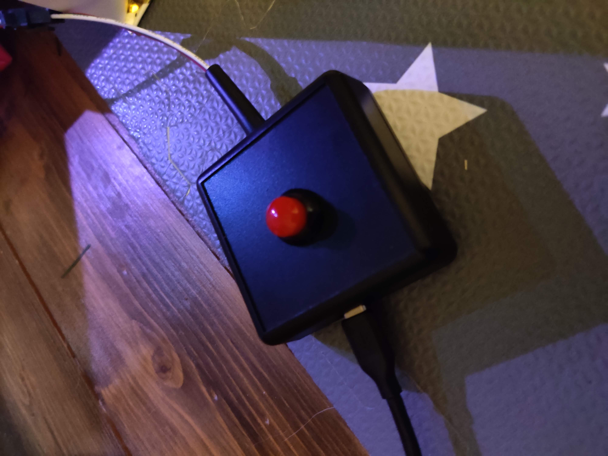

# Xmas Tree - Neopixel style
### Hayden Watkins, 2022

NeoPixel strip example for Raspberry Pi Pico running CircuitPython. I have this in mind to light up a christmas tree - I wanted to have a randomized rocket/sparkle/comet trail going up the tree every so often. 

With an optional bonus button for my daughter to interact and trigger the comet. This button has the option to extend the keep awake time - adding 15 minutes to the timer for each button press before the LEDs turn off. This provides a more friendly power consumption and easy wake-up function.

In addition, there is an optional "top" section of the LED stip / neopixel chain which will have a hue colourwheel animation - which gets brighter when a comet hits the top. This can be defined as the 

The brightness of neopixels is kept low, so current consumption hasn't been a problem when driving on computer USB port, though I wouldn't recommend it long term.

### References

Based on various tutorials and ramblings, but primarily:
* CircuitPython https://learn.adafruit.com/welcome-to-circuitpython/overview
* Dave's Garage Comet Effect https://www.youtube.com/watch?v=yM5dY7K2KHM
* Adafruit FancyLED for HSV calculations https://docs.circuitpython.org/projects/fancyled/en/latest/api.html

### Installation

1. Download files (`code.py`)
2. Adjust parameters at the top of `code.py` as needed
3. Plug in suitable hardware to your computer.
4. Copy the code.py file to the USB drive of the microprocessor.
5. Enjoy (After plugging in to a better power supply than your computer's USB port

### Requirements

REQUIRED MODULES/LIBRARIES:
* CircuitPython deployed on hardware
* Adafruit neopixel
* Adafruit fancyled

REQUIRED HARDWARE:
* Pimoroni Plasma2040 (Or other Raspberry Pi Pico, or even CircuitPython compatible microprocessor).
* 5V power supply, rated for the number of neopixels being driven - USB-C if using the Plasma2040
* RGB NeoPixel LEDs connected to pin GP15 (default, can be configured)
* If not using the Plasma2040:
** Need a ~1000uF capacitor between 5V and GND
** Need a ~300R resistor between GPIO and DATA

OPTIONAL HARDWARE:
* Button between GND and GP12

### Parameters

There are a bunch of configurable parameters at the top of `code.py`, but the key ones you will likely want to change:

* pixel_pin = board.GP15              # GPIO pin for talking to the pixels
* button_pin = board.GP26 # 12        # GPIO pin for button to trigger a chaser
* num_chaser_pixels = 100             # Number of neopixels for the chaser animation
* num_top_pixels = 1                  # Number of neopixels for the top animation
* max_brightness = 0.30               # Scalar on the max brightness. 1 = max.
* time_to_idle_delta = 900            # Extra time in seconds added before idle when pressing the button

### Development

Bought a Pimoroni Plasma2040 to provide a more ruggedized circuit and to run off USB C - as it would be deployed in the family lounge. Also the Slim LED dots are more spaced out, so the effects need speeding up.
I originally had 3 of the Slim LED strips - but ended up needing 5 to cover the tree nicely. The needs of your tree may vary!

TESTED HARDWARE:
* Pimoroni Plasma2040 https://shop.pimoroni.com/products/plasma-2040?variant=39410354847827
** Data = GP15
** Switch A = GP12
** Switch B = GP13
* QTY5 - Adafruit NeoPixel Slim LED Dot Strand - 20 LEDs at 2" Pitch
** 100 pixels
** max brightness 0.30
** Running off of 5V 2A power supply, or the computer USB
* QTY1 - Adafruit NeoPixel LED Side Light Strip - Black 120 LED
** Used for another project, but used here for quick development.
** 120 pixels
** max brightness 0.02 (for testing)
** Running off computer USB

Side-goal of the project is to familiarize myself with CircuitPython (maybe MicroPython later) with a "simple" project.
